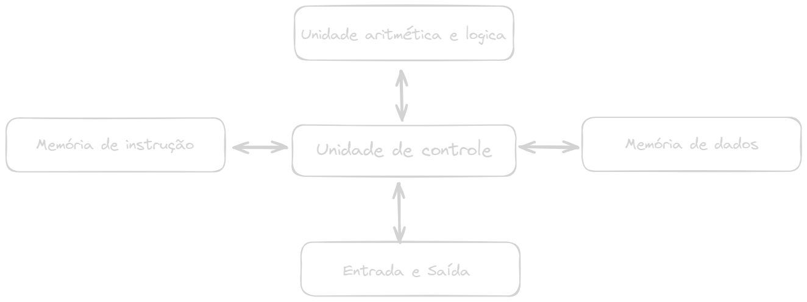

# Arquitetura de computadores

[PROCESSAMENTO EM PARALELO:](./PROCESSAMENTO%20EM%20PARALELO%20bef4e51699164f01acab7c03d6ed7509.md)

### Arquitetura de computadores refere-se ao design e organização de componentes físicos e lógicos de um computador.

**Existem diferentes tipos de arquitetura, como a de Von Neauman e a de Harvard.**

- Em resumo, arquitetura de computadores refere-se ao projeto e organização dos componentes de hardware e software de um computador visando que ele possa executar as operações de forma eficiente e eficaz;

**HARDWARE:** Componentes físicos de um dispositivo

- **Memória RAM:** onde os dados são armazenados enquanto o computador está em uso;
- **CPU:** cérebro do computador responsável por executar todas as informações e processar todos os dados;
- **Disco rígido (HD ou SSD):** unidade de armazenamento permanente do computador;
- **Placa mãe:** Placa que conecta todos os componentes;
- **Teclado e mouse:** dispositivos periféricos;

**SOFTWARE:** Conjunto de programas e instruções que controlam o hardware, existem dos tipos principais de software: sistemas operacionais (que são responsáveis por gerenciar recursos de hardware e interação com usuário) e aplicativos (que são programas criados para tarefas específicas)

- **Sistema Operacional:** Software principal que controla o hardware e fornece serviços e recursos para outros programas;
- **Aplicativos:** Programas criados para realizares tarefas específicas;

**ARQUITETURA VON NEAUMANA: proposta na década de 40**

- Nela temos a ideia de que o programa e os dados são armazenados na mesma memória e manipulados por uma unidade central de processamento (CPU) que executa instruções sequencialmente, ela consiste em quatro componentes principais: *CPU*, *memória*, *dispositivo de entrada/saída*, *barramentos* (conjunto de linhas que permitem a transferência de dados e instruções entre os componentes da CPU, memória e dispositivos de entrada/saída);

**ARQUITETURA HARVARD**

**ARQUITETURA VON NEAUMAN**

### PROCESSO QUE A CPU SEGUE PARA EXECUTAR INSTRUÇÕES DE UM PROGRAMA:

Por fim, vale ressaltar que a arquitetura de Von Neumann tem suas limitações(gargalo). Uma das principais limitação  e a na velocidade de processamento, uma vez que a CPU deve acessar a memoria para cada instrução e dado que processa. Outra limitação é que o processamento em paralelo é difícil de ser implementado de forma eficiente, uma vez que a CPU executa instruções sequencialmente. Para contornar essas limitações, foram desenvolvidas outras arquiteturas, como a arquitetura SIMD (Single Instruction Multiple Data) e a arquitetura MIMD (Multiple Instruction Multiple Data).

### MÁQUINA DE TURING:

Alan Turing → pioneiro da computação;

Contribuiu para a teoria da computação e da inteligência artificial;

Ajudou a quebrar o código alemão Enigma durante a segunda guerra mundial;

Desenvolveu o conceito de uma máquina teórica → modelo de computador;

**MÁQUINA DE TURING:** Modelo teórico que permitiria realizar cálculos matemáticos e desenvolveu o conceito de computabilidade (ESSA PALAVRA NÃO PARECE EXISTIR EM UM MUNDO NORMAL) → Diz que existe um conjunto limitado de problemas que poder ser resolvidos por um computador.

**COMO FUNCIONA:** Basicamente uma máquina de Turing consiste em uma fita infinita dividida em células, uma cabeça de leitura/escrita, e um conjunto de regras que são baseados em estados, essa estrutura permite que a máquina realize operações lógicas e matemáticas. 

> Uma máquina de Turing é uma maquina universal, ela é capaz de simular qualquer computador moderno.
> 

Em resumo a máquina de Turing é um modelo teórico de computador em que temos uma fita infinita dividida em células, uma cabeça de leitura/escrita, e um conjunto de regras e estados que permitem que a máquina execute operações matemáticas e lógicas. CONSIDERADA UMA MÁQUINA UNIVERSAL

## Revolução tecnológica

### Primeiro computador pessoal

O primeiro computador pessoal foi fabricado pela Apple, seu nome é Apple ll e foi lançado em 1977

> Primeiro produto da Microsoft foi o DOS (Disck Operating System)
> 

## Evolução dos computadores

### Primeira geração- Válvulas termiônicas

Válvula termiônicas: ainda durante a segunda guerra mundial foi desenvolvido o primeiro computador eletrônico da história, o ENIAC, um computador integrador numérico telefônico;

### Segunda geração- Transistores

Os primeiros transistores ocupavam bem, menos espaço que as válvulas, sendo assim possível reduzir o tamanho de rádios, equipamentos eletrônicos e computadores;

### Terceira geração - circuitos integrados

Circuitos integrados: CI (pastilhas de silício que contém um circuito eletrônico miniaturizado), popularmente conhecido como chip de computador;

### Quarta geração - Microprocessadores

A década de 1980 presenciou a proliferação de PCs cada vez mais potentes, baratos e conectados por meio do surgimento das redes locais de computadores e da internet: a rede mundial. Além disso, um novo equipamento aparecia nos lares: o videogame, um tipo de computador especializado, cujos programas são jogos eletrônicos com ênfase nos gráficos e na interação com os usuários.

### Quinta geração - Inteligência artificial

Integração de tecnologias de Inteligência Artificial nos sistemas computacionais.
Uso de **processadores paralelos** para aumentar a eficiência e velocidade de processamento. Desenvolvimento e implementação de sistemas capazes de **reconhecimento de padrões** e **processamento de linguagem natural**. Avanços em redes neurais e algoritmos de aprendizado de maquina, permitindo que os computadores "aprendam" com os dados e melhorem seu desempenho ao longo do tempo.

### Hardware X Software

Hardware vc chuta e o Software vc xinga

### Componentes do hardware

- Placa mãe
- Memória principal (Memória RAM)
- Memória Secundária (HD, SSD)
- Processador
- Periféricos

### Sistemas operacionais

Um sistema operacional é um programa  intermediário que gerencia os recursos de hardware do computador, fornece acesso a eles por meio de programas.

**TIPOS DE SISTEMAS OPERACIONAIS**

- **Uso pessoal:** Windows, Linux
- **Sistemas operacionais servidores:** São projetados para computadores de alto desempenho. Alguns exemplo deles são: Microsoft Windows Server, Linux e Unix.
- **Sistemas operacionais de mainframes:** São projetados para computadores de grande porte, como o da IBM Z/OS.
- **Sistemas operacionais embarcados:** São sistemas operacionais que são usados em dispositivos eletrônicos, alguns deles são Linux, FreeRTOS e  VxWorks.

### UNIX

Unix é um sistema operacional criado na década de 1960, que oferece uma interface de linha de comando (CLI) para interagir com o sistema. É conhecido por sua robustez, estabilidade e escalabilidade, e é amplamente utilizado em academia, indústria e governo. Algumas de suas características incluem um sistema de arquivos hierárquico, capacidade de rede, suporte a multitarefa e multiprocessamento, e o uso de "pipes" e "prompts" para processamento de dados.

Algorithm: sequência de passos

Compiler: programa que traduz um programa de alto nível em um independente

Debugging: Detecção e correção de erros em um programa

Deploy v1: colocar o código no servidor para que ele possa ser executado

End User: indivíduo que usa um produto específico

deploy v2: transferência do software do ambiente de desenvolvimento para o ambiente de produção para ser acessado pelos usuários finais

Make: ferramenta de automação do build que constrói executáveis 

Buid: Processo de converter código fonte em código executável por meio de compilação

Commit: Atualizar o repositório de código com mudanças ou novas adições

Merge: combinar diferentes versões de código fonte

Branch: cópia de código fonte para serem usadas por desenvolvedores para fazer alterações antes de mesclar tudo no código original

Repository: local de armazenamento para código

Version Control: sistema que registra alterações no código fonte ao longo do tempo

API: conjunto de definições e protocolos para construir e integrar software de aplicação

Framework: coleção de bibliotecas ou componentes que são usados para desenvolver uma aplicação com uma estrutura bem definida

**SISTEMA OPERACIONAL:** Conjunto de software e hardware que gerencia os recursos de um computador.

### Componentes Genéricos de um OS

- Compilador
- Editor de texto
- Browser
- Quake

### Tipos de OS

- **OS mono tarefa:** Só executa um programa de cada vez
- **OS multitarefa:** Neste tipo de sistema, enquanto um programa espera por uma operação de leitura/gravação no disco, outros programas podem estar sendo processados.
- **OS batch: Os** primeiros OS eram desse tipo, sua programação era feira por meio de cartões perfurados, e sua memória era por meio de fita
- **OS tempo compartilhado:** Permitem que diversos programas sejam executados a partir da divisão do tempo do processador em pequenos intervalos, denominados fatia de tempo (time-slice). Caso a fatia de tempo não seja suficiente para a execução do programa, ele é interrompido, substituído por outro e fica aguardando uma nova fatia de tempo para continuar sua execução.
- **OS tempo real:** Enquanto em sistemas de tempo compartilhado o tempo do processamento pode variar sem comprometer as aplicações em execução, nos sistemas de tempo real os tempos de processamento devem estar dentro de limites rígidos, que devem ser obedecidos, caso contrario poderão ocorrer problemas irreparáveis.
- **OS multiprocessadores:** Os sistemas com múltiplos processadores caracterizam-se por possuir duas ou mais UCPs interligadas e trabalhando em conjunto. A vantagem deste tipo de sistema é permitir que vários programas sejam executados ao mesmo tempo ou que um mesmo programa seja subdividido em partes para serem executados simultaneamente.

> Nos primeiros OS a programação era feita através de fiação
> 

### Componentes de um Sistema Operacional

- **Kernel:** Coração do sistema operacional, gerencia a memória, os processos e as interações com o hardware, seus tipos são: monolítico, microkernel e hibrido.
- **Shell:** Interface que permite aos usuários comunicar-se com o kernel através de comandos ou uma interface gráfica.
- **Utilitários de Sistema:** Conjunto de ferramentas para configurar o sistema operacional, monitorar seu desempenho e realizar tarefas administrativas.

