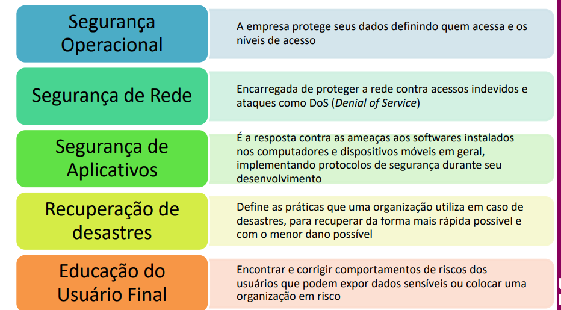

# Segurança

[Simurado 02 - 1° Semestre](./Simurado%2002%20-%201°%20Semestre%20848a8ce621d948b3a8111a705a83d35f.md)

# Cibersegurança

Conjunto de ações e técnicas para proteger sistemas, programas tudo

# Dado X Informação

Dado = pedra

informação = pedra trabalhada

## PSI → Politica de segurança da informação

## CID → Confiabilidade, Integridade e Disponibilidade

1. **Ransomware**:
    - Ransomware é um tipo de software malicioso (malware) projetado para criptografar os arquivos de um sistema ou bloquear o acesso a ele de alguma forma, geralmente através da criptografia, e em seguida, exige um resgate (ransom) para restaurar o acesso. Os criminosos geralmente pedem o pagamento em criptomoedas para dificultar o rastreamento. Uma vez pago o resgate, o criminoso deve fornecer uma chave ou ferramenta para descriptografar os arquivos ou restaurar o acesso ao sistema.
2. **Malware**:
    - Malware é uma abreviação de "software malicioso", e é um termo genérico para qualquer tipo de software projetado para danificar, invadir ou controlar um sistema de computador sem o consentimento do usuário. Isso pode incluir vírus, worms, trojans, spyware, adware e outros tipos de programas maliciosos.
3. **Spyware**:
    - Spyware é um tipo específico de malware projetado para coletar informações sobre os usuários de um sistema sem o consentimento deles. Isso pode incluir informações como histórico de navegação na web, senhas, dados de cartão de crédito e outras informações pessoais. O spyware geralmente é instalado secretamente e pode ser usado para monitorar as atividades do usuário, exibir anúncios direcionados ou até mesmo roubar informações confidenciais.
4. **Engenharia Social**:
    - A engenharia social é uma técnica usada por hackers e criminosos cibernéticos para manipular as pessoas e obter acesso não autorizado a sistemas de computador ou informações confidenciais. Isso pode incluir técnicas como phishing, onde os criminosos enviam e-mails falsos que parecem ser de fontes legítimas para enganar as pessoas a revelar informações pessoais ou clicar em links maliciosos. A engenharia social também pode envolver a manipulação psicológica das vítimas para convencê-las a fornecer informações confidenciais ou executar ações que beneficiem o invasor.
5. **DDoS (Distributed Denial of Service)**:
    - Um ataque de negação de serviço distribuído (DDoS) é uma tentativa de tornar um servidor, serviço ou rede indisponível para os usuários, sobrecarregando-o com um grande volume de tráfego de internet. Isso é feito usando uma rede de computadores comprometidos, conhecidos como botnets, para enviar tráfego malicioso para o alvo. O objetivo de um ataque DDoS é interromper o funcionamento normal de um serviço online, tornando-o inacessível para seus usuários legítimos. Este tipo de ataque pode ser usado para extorsão, sabotagem, ou simplesmente para causar interrupções e danos.
    
    
    
    
    
    # Pilares da segurança
    
    - Identifica
    - Proteger
    - Detectar
    - Responder
    - Recuperar
    
    # CERT.br
    
    blog
    
    
    
    
    
    
    
    ---
    
    # Tema 7 do sava: Gestão de continuidade de negócios:
    
    PCN - plano de continuidade de negócios diz respeito a elaboração de estratégias e planos de ação com o intuito de identificar e preservar os serviços essenciais de uma organização caso ocorra um **desastre**, garantindo a recuperação, a continuidade e a retomada da situação normal de funcionamento da empresa.
    
    
    
    Ele atua definindo de que forma e quais ações devem ter para a resposta efetiva da empresa e proteção de dados;
    
    O Plano de Continuidade de Negócios (PCN) orienta a empresa sobre como agir diante de ameaças e impactos nas operações, visando garantir a continuidade do negócio. Ele busca minimizar problemas causados por interrupções nas atividades e proteger processos críticos contra grandes falhas ou desastres.
    
    
    
    O PCN é composto pelos seguintes planos:
    
    PLANO DE CONTIGÊNCIA (EMERGÊNCIA)99999696
    
    
    
    PLANO DE ADMINISTRAÇÃO DE CRISES (PAC)
    
    
    
    PLANO DE RECUPERAÇÃO DE DESASTRES (PRD)
    
    
    
    PLANO DE CONTINUIDADE OPERACIONAL(PCO)
    
    
    
    PDCA ESTÁ RELACIONADO AO PCN
    
    
    
    
    
    
    
    
    
    
    
    ### **Política de Gestão de Continuidade de Negócios (PGCN)**
    
    **O propósito da PGCN é fornecer uma base para que se possa entender, desenvolver e implementar a continuidade de negócios em uma organização, além de fortalecer a confiança nos negócios junto aos clientes e a outras organizações. A PGCN permite também que a organização avalie sua capacidade de Gestão de Continuidade de Negócios (GCN) de uma maneira consistente e reconhecida.**
    
    ### **ITIL (Gerenciamento de Continuidade)**
    
    # Continuidade de Serviços de Tecnologia da Informação (GCSTI)
    
    O objetivo do GCSTI é **gerenciar riscos capazes de afetar os serviços de TI**. Desse modo, ajuda a manter de maneira adequada a capacidade de recuperação de serviços de TI para atender às necessidades acordadas, aos requisitos e aos prazos do negócio.
    
    
    
    
    
    
    
    
    
    
    
    
    
    